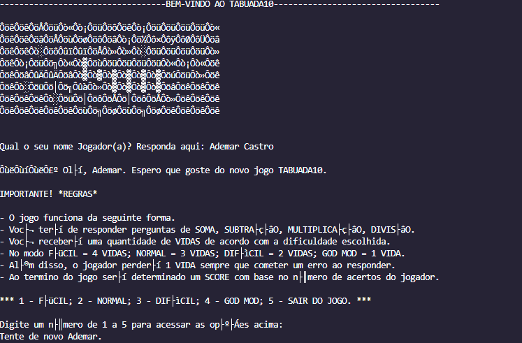

 # 🎮 Tabuada10 - Jogo de Matemática Divertido

Bem-vindo ao Tabuada10! 🎉 Um jogo divertido para você praticar suas habilidades matemáticas. Vamos começar?

## Projeto

## Como Jogar:
1. Insira o seu nome para começar.
2. Escolha a dificuldade do jogo: FÁCIL, NORMAL, DIFÍCIL ou GOD MODE.
3. Responda às perguntas de matemática corretamente para acumular pontos.
4. Cada resposta correta aumenta o seu score.
5. Cada resposta incorreta resulta na perda de uma vida.
6. O jogo continua até que você perca todas as vidas.
7. No final, o seu score será exibido.

## 🚀 Divirta-se e mostre suas habilidades matemáticas!

### Requisitos de Sistema:
- Certifique-se de ter um compilador C instalado no seu sistema.

- Para jogar:
  - Copie o código fonte do jogo para um arquivo com a extensão ".c" (por exemplo, "tabuada10.c").
  - Abra o terminal ou prompt de comando no diretório onde o arquivo ".c" está localizado.
  - Compile o código fonte usando um compilador C, como o GCC, com o seguinte comando: `gcc tabuada10.c -o tabuada10`.
  - Após compilar com sucesso, execute o jogo digitando o comando: `./tabuada10` (ou `tabuada10.exe` no Windows).
  - Siga as instruções exibidas na tela para jogar o Tabuada10.

### 🙌 Aproveite e bons cálculos!

## Autores:
O jogo Tabuada10 foi desenvolvido por Ademar Alves Castro Filho como parte de um exercício para a disciplina de Algoritmos e Técnicas de Programação.